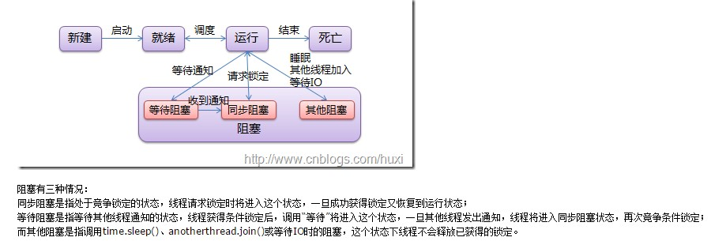
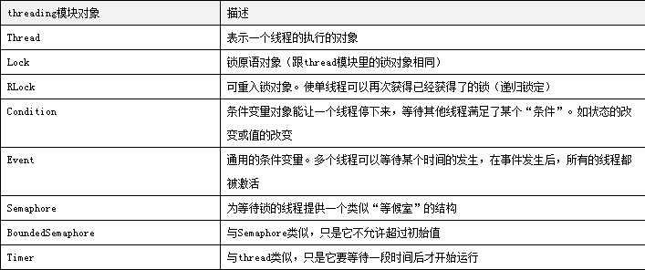

## 线程(thread)

Python通过两个标准库thread和threading提供对线程的支持。

##### 线程运行和阻塞状态图

### 1.全局解释器锁(GIL)
Python代码的执行由Python虚拟机（也叫解释器主循环）来控制。Python在设置之初就考虑到要在主循环中，同时只有一个线程在执行，就像单CPU的系统中运行多个进程那样，内存中可以存放多个程序，但任意时刻，只有一个程序在CPU中运行。同样，虽然Python解释器可以“运行”多个线程，但任意时刻，只有一个线程在解释器中运行。

对Python虚拟机的访问由全局解释器锁（global interpreter lock，GIL）来控制，正是这个锁能保证同一时刻只有一个线程在运行。在多线程环境中，Python虚拟机按以下方式执行：

1. 设置GIL
2. 切换到一个线程去运行
3. 运行：
   a.指定数量的字节码的指令，或者
   b.线程主动让出控制（可以调用time.sleep(0)）
4. 把线程设置为睡眠状态
5. 解锁GIL
6. 再次重复以上所有步骤

### 2.线程
#### 2.1 thread(基本不用)
thread提供了低级别的、原始的线程以及一个简单的锁(仅一个)。

##### 模块函数

1. start_new_thread(function, args kwargs=None) 产生一个新线程，在新线程中用指定的参数和可选的kwargs来调用该函数
2. allocate_lock() 分配一个LockType类型的锁对象
3. exit() 让线程退出

##### 类型锁对象方法

1. acquire(wait=None) 尝试获取锁对象
2. locked() 如果获取了锁对象返回True，否则返回False
3. release() 释放锁

参考实例[thread.py](./thread.py)

##### thread模块存在的问题

1. 低级别的thread模块的同步原语很少（实际只有一个），而threading模块则有很多
2. thread对你的进程什么时候应该结束完全没有控制，当主线程结束时，所有的线程都会被强制结束掉，没有警告也不会有正常的清除工作。而threading模块能确保重要的子线程退出后进程才退出

#### 2.2 threading

##### 三种方式创建线程
1. 创建一个Thread的实例，传给它一个函数
[threading-1.py](./threading-1.py)

2. 创建一个Thread的实例，传给它一个可调用的类对象
[threading-2.py](./threading-2.py)

3. 从Thread派生出一个子类，创建一个这个子类的实例
[threading-3.py](./threading-3.py)