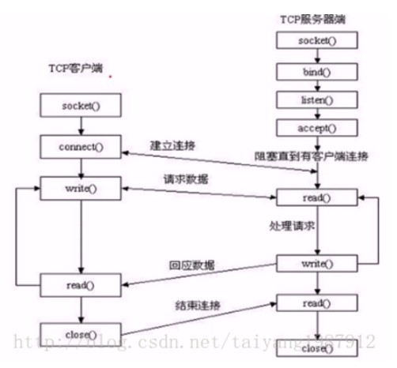
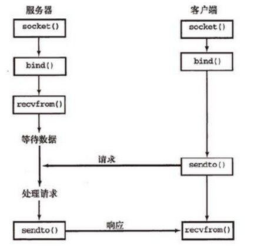
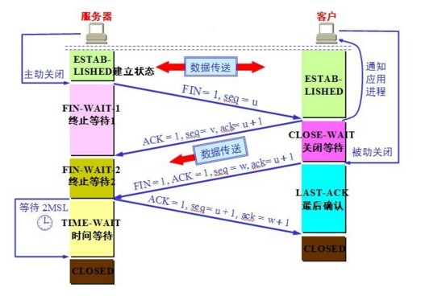

## socket

##### 交互图

1. TCP

2. UDP

##### 导入方法
import socket 或 from socket import *
***
##### socket接口使用例子
**.listen(backlog)** *开始监听TCP传入连接。backlog指定在拒绝连接之前，操作系统可以挂起的最大连接数量。该值至少为1，大部分应用程序设为5就可以了，并不是指最大客户端连接数。*

**.sendall(string[,flag])** *完整发送TCP数据。将string中的数据发送到连接的套接字，但在返回之前会尝试发送所有数据。成功返回None，失败则抛出异常*

**.recvfrom(bufsize[.flag])** *接受UDP套接字的数据*

**.sendto(string[,flag],address)** *发送UDP数据*

等等
*** 

##### 多线程实现的例子

1. 创建一个Thread的server端，使用telnet连接

[server(thread).py](./server(thread).py)

2. 创建一个Threading的server端，和与之对应的client端

[server(threading).py](./server(threading).py)

[client(follow-threading).py](./client(follow-threading).py)

***
##### kips:
1. 消除主动关闭方TIME_WAIT状态

   存在的理由：
   
   a) 可靠地实现TCP全双工连接的终止
   
   b) 防止上一次连接中的包，迷路后重新出现，影响新连接，经过2MSL，上一次连接中所有的重复包都会消失
   
   c) 解释如下图
   

   (1) 如果服务器最后发送的ACK因为某种原因丢失了，那么客户一定会重新发送FIN，这样因为有TIME_WAIT的存在，服务器会重新发送ACK给客户，如果没有TIME_WAIT，那么无论客户有没有收到ACK，服务器都已经关掉连接了，此时客户重新发送FIN，服务器将不会发送ACK，而是RST，从而使客户端报错。也就是说，TIME_WAIT有助于可靠地实现TCP全双工连接的终止。
　 (2) 如果没有TIME_WAIT，我们可以在最后一个ACK还未到达客户的时候，就建立一个新的连接。那么此时，如果客户收到了这个ACK的话，就乱套了，必须保证这个ACK完全死掉之后，才能建立新的连接。也就是说，TIME_WAIT允许老的重复分节在网络中消逝。
   
   避免方法：

    `optval = struct.pack("ii",1,0)`

     `socket.setsockopt(SOL_SOCKET, SO_LINGER, optval)`

   